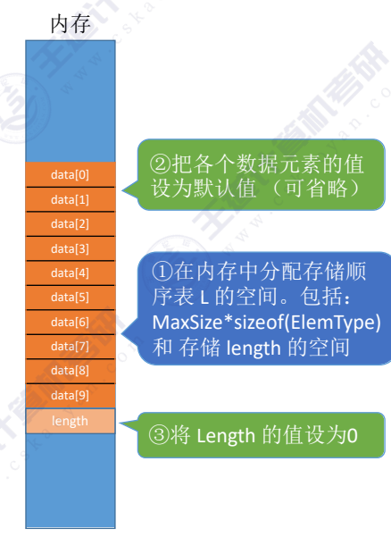
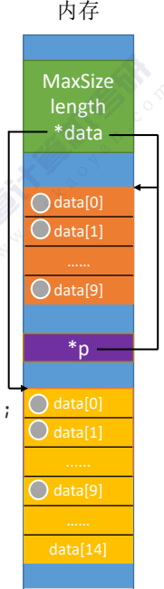
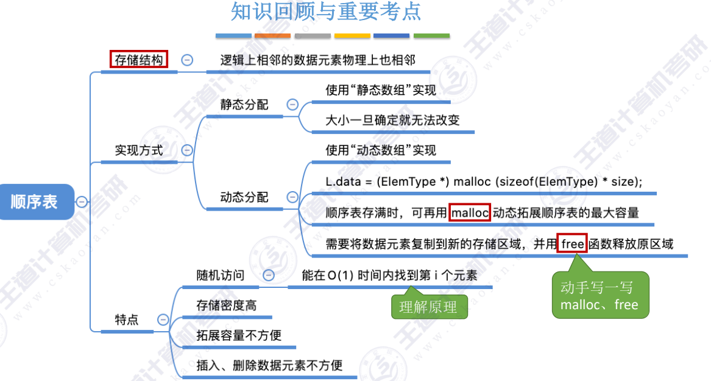

## 定义
  **顺序表——用顺序存储的方式实现线性表**
  
- 顺序存储:逻辑位置&物理位置上都相邻存储


---
##### 静态存储空间分配方式：
规定大小便无法再改变
###### 定义：
```c
#define MAXSIZE 10 // 最大长度
typedef struct{
    elementType data[MAXSIZE];
    int length;
}SqList; //(Sequence List)
```

###### 初始化
~~~c
void InitList(SqList &L){
    for (int i=0; i<MAXSIZE; i++)
        L.data[i] = 0;  // 初始化所有元素为0,去掉之前内存中的脏数据
    L.length = 0;   // 初始长度为0
}
~~~


###### 动态存储空间分配方式

###### 定义：
```c
#define InitSize 10 // 初始长度
typedef struct{
    elementType *data; // 存储空间基地址
    int MaxSize; // 最大长度
    int length; 
}SqList; 
```
###### 初始化
~~~c
void InitList(SqList &L){
    L.data = (elementType *)malloc(InitSize * sizeof(elementType));  //申请一片连续的存储空间,对应上方的存储空间基地址
    L.length = 0;
    L.MaxSize = InitSize;
}
~~~

###### 增加动态数组的长度
~~~c
void IncreaseSize(SqList &L, int len){
    elementType *p = L.data; //备份旧地址
    L.data = (elementType *)malloc(p, (L.MaxSize+len) * sizeof(elementType)); //申请新空间
    for (int i=0; i<L.length; i++)
    {
        L.data[i] = p[i]; // 将搬运数据（复制）
    }
    L.MaxSize += len; // 更新最大长度
    free(p); // 释放原数组
}
~~~




## ps
- 两种储存类型都可以在 O(1) 时间内找到第 i 个元素
- 使用malloc需要引入头文件#include <stdlib.h>
