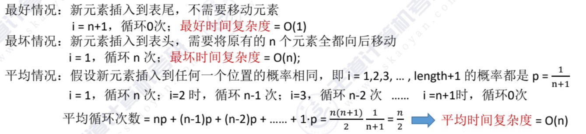
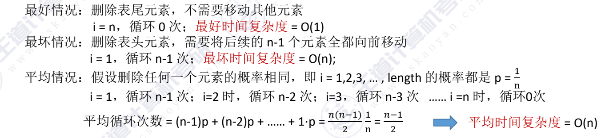
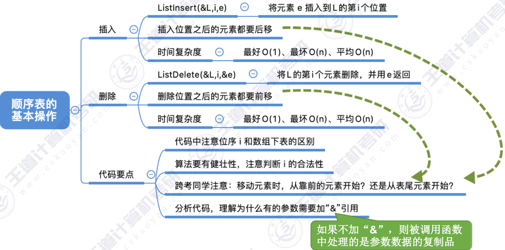

## 插入操作
ListInsert(&L,i,e)：在L的第i个位置插入元素e

```c
#define Maxsize 10
typedef struct{
    ElementType data[Maxsize];;
    int length;
}SqList;
```
ps:本次考虑的是“静态分配”的顺序表

~~~c
bool ListInsert(SqList &L,int i,ElementType e){
    if(i<1 || i>L.length+1)  // 插入位置越界
    return false;
    if(L.length>=Maxsize) // 顺序表已满
    return false;
    for (int j=L.length; j>=i; j--) // 循环将第i个位置之后的元素后移一位
    L.data[j] = L.data[j-1]; // 将第i个位置之后的元素后移一位
    L.data[i-1] = e; // 插入元素e
    L.length++;
}
~~~

~~~c
int main(){ 
    Sqlist L;
    InitList(L);
    ...
    ListInsert(L,1,5); // 在第一个位置插入5
    return 0;
}
~~~
时间复杂度分析:


---
## 删除操作
~~~c
bool ListDelete(SqList &L,int i,ElementType &e){
    if(i<1||i>L.length)
        return false;
    e=L.data[i-1];  // 记录删除的元素
    for (int j=i; j<L.length; j++) // 循环将第i个位置之后的元素前移一位，用j迭代
        L.data[j-1] = L.data[j]; // 将第i个位置之后的元素前移一位
    L.length--;
    return true;
 }
~~~

~~~c
int main(){ 
    Sqlist L;
    InitList(L);
    ...
    ElementType e = -1;  // 用于存储被删除的元素
    if(ListDelete(L,1,e)){
        printf("删除的元素是%d\n",e);
    }
    else
        printf("删除失败\n");
    return 0;
}
~~~
时间复杂度分析：

---
