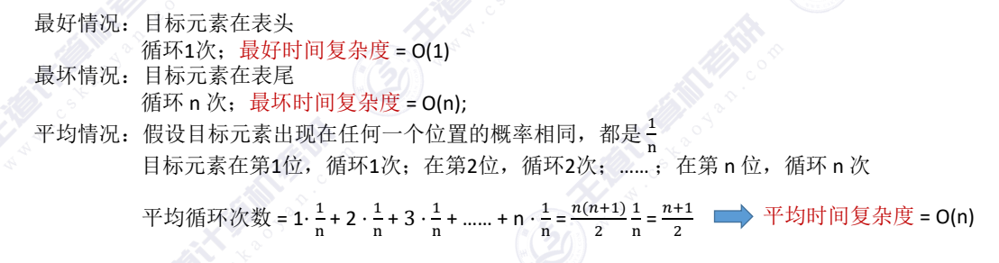
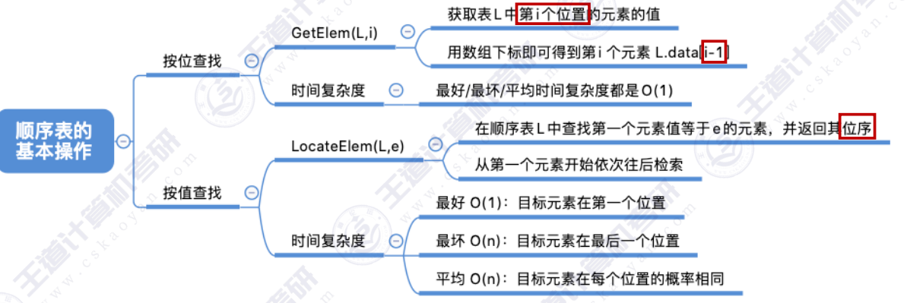

## 顺序表的查找
- 按位查找
- 按值查找

# 按位查找
GetElem(L,i)：按位查找操作。获取表L中第i个位置的元素的值
（采用静态分配）
~~~c
#define MaxSize 10
typedef struct{
    ElemType data[MaxSize];
    int length;
}SqList;

ElemType GetElem(SqList L,int i){ //i从1开始
    return L.data[i-1];
}
~~~

时间复杂度：O(1)

# 按值查找
LocateElem(L,e)：按值查找操作。在表L中查找具有给定关键字值的元素。
(采用动态分配)
~~~c
typedef struct{
    int *data;  //指示动态分配数组的指
    int MaxSize;  //顺序表的最大容量
    int length; //顺序表的当前长
}SqList;

int LocateElem(SeqList L,ElemType e) ////在顺序表L中查找第一个元素值等于e的元素，并返回其位序
{ 
    for(int i=0;i<L.length;i++)
        if(L.data[i]==e)
            return i+1; //数组下标为i的元素值等于e，返回其位序i+1
    return 0; //退出循环，说明查找失败}
}
~~~ 

时间复杂度：

---
小结
