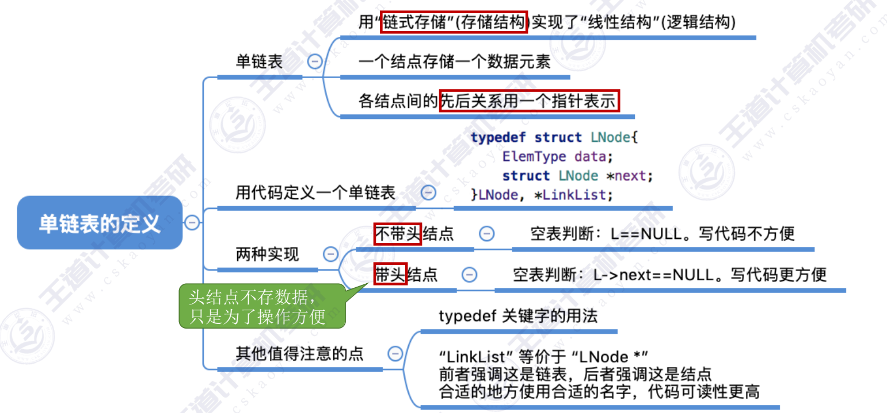

## 单链表的定义
- 随机存取，不需要连续的空间就行，但需要耗费空间存放指针

定义：
~~~c
typedef struct LNode{
    ElementType data;    //每个节点存放一个数据
    struct LNode *next; //指针指向下一个节点
}:LNode,*LinkList; //强调这是一个单链表使用LinkList；强调这是一个结点使用LNode *
~~~
---
- 单链表的初始化:
  ~~~c
  bool InitList(LinkList &L){ 
    L = NULL; //定义一个空表
    return true;
  }
    后续：
    ...
    LinkList L; //定义一个单链表
    ..
    InitList(L);    //初始化单链表

<font color=red>不过还是推荐带头结点！！！</font>
~~~ c
bool InitList(LinkList &L){ 
    L = (LNode *)malloc(sizeof(LNode)); //申请一个头结点
    if(L==NULL) //内存不足，申请失败
        return false;
    L->next = NULL; //将头节点之后设定为空
    return true;
}
~~~

再次强调：LNode *和LinkList本身都是一样的，但是LNode *重点强调节点，而LinkList重点强调整个表

- e.g.
  ``` c
  LNode * GetElem(LinkList L,int i){ //这里LNode *强调返回的是一个结点，而参数LinkList强调这是单链表
    int j = 0;
    LNode *p = L->next; //p指向第一个节点
    if ( i == 0 )
        return L;
    if ( i < 0 )
        return NULL;
    while ( p && j < i ){
        p = p->next;
        j++; //循环找到第i个节点
    }
}

---
结