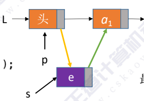
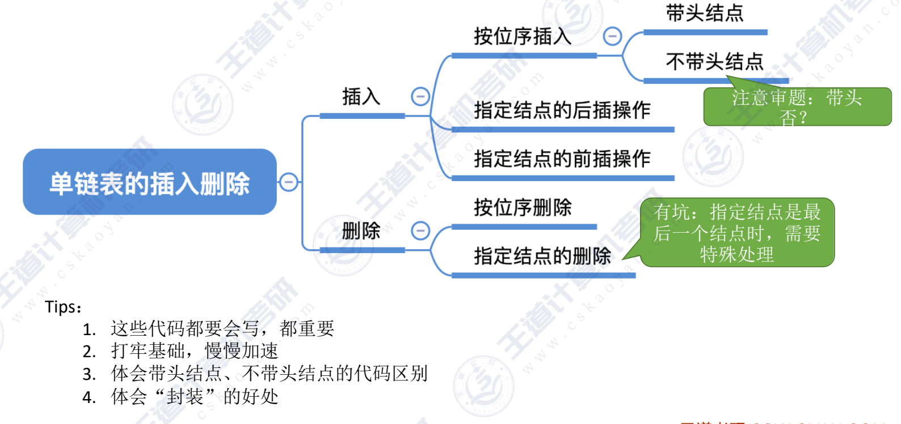

## 单链表的插入与删除
- ListInsert(&L,i,e)：插入操作。在表L中的第i个位置上插入指定元素e（也就是在i-1个结点然后插入其中）。

ps:**头结点的链表的第0个节点可以看作头节点**

#### 按位序插入（带头节点）：
~~~c
typedef struct LNode{
    Elemtype data;
    struct LNode *next;
}LNode,*LinkList;

bool LinstInsert(LinkList &L,int i,ElemType e){
     if (i<1) // i的位置不合法
          return false;
    LNode *p; //指针p用于指向当前扫描的节点
    int j = 0; //记录p指向的是第几个节点
    p = L; //使指针p指向头结点
    while(p != NULL && j < i-1>) //通过循环让p接着找后面的节点，直到找到i - 1个节点
    {
        p = p->next;
        j++;
    }
    if (p == NULL)  //i 的位置不合法
        return false;

    LNode *s = (LNode *)malloc(sizeof(LNode));  //申请一个新的节点s
    s->data = e;  //让s指针指向想要插入的节点
    s->next = p->next;
    p->next = s;    //将s插入到p之后
    return true; //插入成功了
}
~~~
如图：

最好时间复杂度：O(1)
最坏时间复杂度：O(n)   

平均时间复杂度：O(n)

#### 不带头结点的按位序插入：
如果不带头结点的话，则插入和删除第一个元素时需要更改头指针L
~~~c
bool ListInsert(LinkList &L,int i,ElemType e){ 
    if (i < 1 )  //插入第一个节点与其他节点不同
        return false;

    if (i == 1)
    {
        LNode *s = (LNode *)malloc(sizeof(LNode));  //申请一个新的节点s
        s -> data = e
        s -> next = L;
        L = s;  //头指针L指向新的节点s
        return true;
    } 

    LNode *p；//指针p指向当前扫描到的节点
    int j = 1 ; //用于记录当前扫描的是第几个节点
    p = L; //让p指针指向第一个节点（不是头节点）
    while( p != NULL && j < i - 1) //循环找到i-1个节点
    {
        p = p -> next; //p指向第i-1个节点
        j++; 
    } 
    
    if ( p == NULL )
        return false;

    LNode *s = (LNode *)malloc(sizeof(LNode));
    s -> data = e;
    s -> next = p -> next;
    p -> next = s;
    return true;  //让s插入p指针后
}
~~~

#### 指定节点的后插操作：
~~~c:
bool InsertNextNode(LNode *p,) //在p节点后插入元素e
{ 
    if（p == NULL ） //p为空，插入失败
        return false;
    LNode *s = (LNode *)malloc(sizeof(LNode))
    if ( s == NULL )//内存分配失败
        return false;
    s -> data = e;  //用结点s保存数据e
    s -> next = p -> next;
    p -> next = s;
    return true;
}
~~~

#### 指定结点的前插操作
~~~c
bool InsertPriorNode(LNode *p, ElementType e)//在p结点之前插入元素e
{
    if (p == NULL ) //p为空，插入失败
        return false;
    Lnode *s = (LNode *)malloc(sizeof(LNode)) //创建一个s结点负责存储插入的元素
    if (s == NULL)
        return false;
    
    s -> next = p -> next; 
    p -> next = s;  //经过这两步骤，将s变成了p的后继
    s -> data = p -> data; //然后将s和p的数据进行调换，将p的数据放入s中
    p -> data = e;//再将e放入p结点中,此时s已经是p结点的后继，所以成功插入到原来的结点前了
     return true;
}
~~~

#### 按位序删除（带头结点）
ListDelete(&L,i,&e)：删除操作。删除表L中第i个位置的元素，并用e返回删除元素的值
~~~c
bool  ListDelete(LinkList &L,int i,ElemType &e)
{
    if (i < 1>)  //i的位置不合法
        return false;

    LNode *p; //p指向当前扫描到的结点
    int j = 0; //j用于记录当前扫描的是第几个结点
    p = L;
    while(p!=NULL && j < i-1)  //循环找到第i-1个结点
    {
        p = p->next;
        j++;
    } 

    if (p==NULL) //i值不合法
        return false;
    
    if(p->next == NULL) //第i-1个结点之后没有结点
        return false;
    
    LNode *q = p->next; //令q指向被删除的结点
    e = q->data; //将被删除的数据保存在e中
    p->next = q->next; 将被删除的结点q从链中断开
    free(q);  释放q结点
    return true; 
}

~~~
#### 指定结点的删除
~~~C
bool DeleteNode(LNode *p) //  删除指定结点p
{
    if(p == NULL) //p为空
        return false;
    LNode *q = p->next;  //令q指向被删除的结点
    p->data = p->next->data;  
    p->next = q->next;
    free(q);
    return true;
    /*想象一下你在排队：张三 (p) -> 李四 (q) -> 王五。
    现在我们想让 张三 (p) 消失，但我们找不到张三前面的人。

    第一步：李四 (q) 把自己的名牌和钱包都给了 张三 (p)。

    第二步：现在的 张三 (p) 虽然脸没变，但兜里装的是李四的钱，胸口挂的是李四的名牌。他现在“变成了”李四。

    第三步：原本的 李四 (q) 已经没用了，直接把他踢出队伍。

    第四步：现在的 “张三（伪装成李四的p）” 直接拉住后面的 王五。

    结果： 队伍变成了 李四(肉体是p) -> 王五。原本的张三数据确实消失了！
    */
}
~~~

---
总结：
