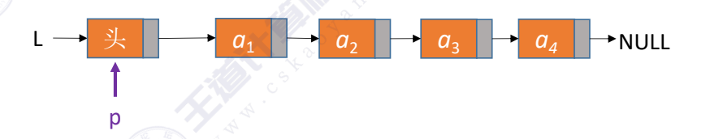
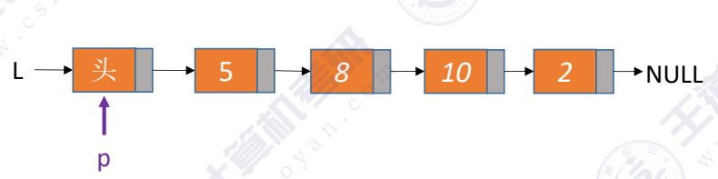
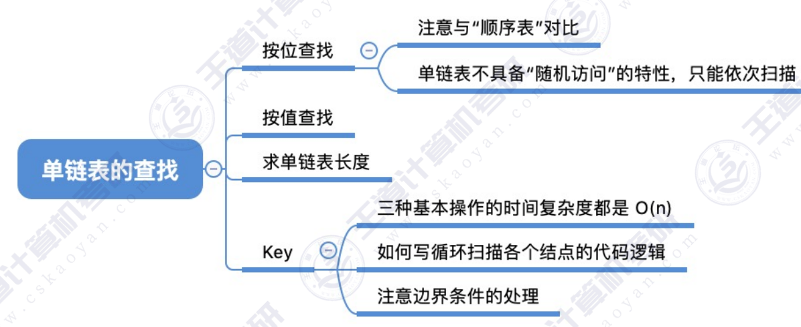

### 按位查找
GetElem(L,i)：按位查找操作。获取表L中第i个位置的元素的值。
~~~c
typedef struct LNode
{
    int data;
    struct LNode * next;
}LNode,*LinkList;

LNode * GetElem(LinkList L,int i)
{
    if (i< 0>)
        return NULL;
    LNode * p;     // p为当前结点
    int j = 0; //用于记录p指向的是第几个结点
    p = L; //L指向头节点，头节点是第0个结点（不存数据）
    while(p != NULL && j < i)
    {
        p = p->next;
        j++;
    }
    return p;
}
~~~

### 按值查找
LocateElem(L,e)：按值查找操作。在表L中查找具有给定关键字值e的元素。
~~~c
LNode * LocateElem(LinkList L,int e)
{
    LNode * p = L -> next; //从第一个结点开始查找数据与为e的结点
    while(p != NULL && p->data != e)
        p = p->next;
    return p; //找到后返回该结点指针，否则返回NULL
}
~~~

### 求表的长度

~~~c
int length(LinkList L)
{
    int len = 0;
    LNode * p = L -> next; 
    while(p != NULL)
    {
        p = p->next;
        len++;
    }
}
~~~

---
总结：