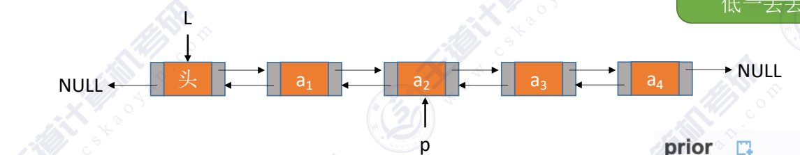
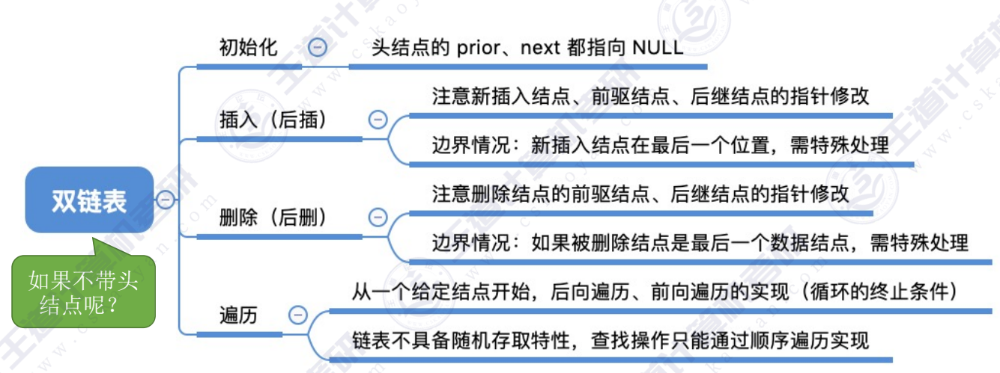

### 双链表的定义
~~~c
typedequ struct LNode{
    Elemtype data;  //数据域
    struct LNode *next, *prior;
}DNode, *DLinkList;
~~~

### 双链表的初始化
~~~c
boolean InitList(DLinkList *L) //初始化双链表
{
    L = (DNode  *)malloc(sizeof(DNode)); //分配一个头结点
    if(L == NULL)
        return false;
    L->prior = NULL;
    L->next = NULL;
    return true;
}

boolbool Empty(DLinkList L)  //判断链表是否为空
{
    if(L->next == NULL)  
        return true;
    else
        return false;
}

int main()
{
    //初始化链表
    DLinkList L;
    InitDLinkList(L);
}

~~~

### 双链表的插入

~~~c
bool InsertNextDNode(DNode *p, DNode *s)  //在p之后插入s
{
    if(p == NULL || s == NULL)
        return false;
    s->next = p->next;
    if(p->next != NULL)  //如果p的结点有后继节点
        p->next->prior = s;  
    s->prior = p;
    p->next = s;  //注意这里的顺序！
    return true;
}
~~~

### 双链表的删除
~~~c
bool DeleteNextDNode(DNode *p)  //删除p结点的后继节点q
{
    if(p == NULL) 
        return false;
    if(q == NULL)
        return false;
    p->next = q->next;  
    if(q->next != NULL)  //如果q有后继节点
        q->next->prior = p; //将q结点的后继节点的前驱指针与p结点连接
    free(q);  //释放q结点
    return true;
}

void DestroyList(DLinkList *L)
{
    while(L ->next != NULL)
        DeleteNextDNode(L, L->next);
    free(L);
    L = NULL;
}  //销毁双链表
~~~

### 双链表的遍历
~~~c
//后向遍历
while(p != NULL){
    p=p->next;
}

//前向遍历
while(p != NULL){
    p=p->prior;
}
//前向遍历（跳过头结点）
while(p->prior != NULL){
    p=p->prior;
}
~~~
双链表不可随机存取，按位查找、按值查找操作都只能用遍历的方式实现。时间复杂度O(n)

---
结：
