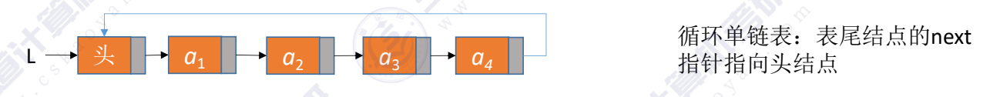
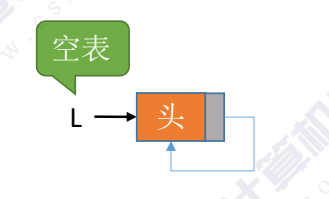
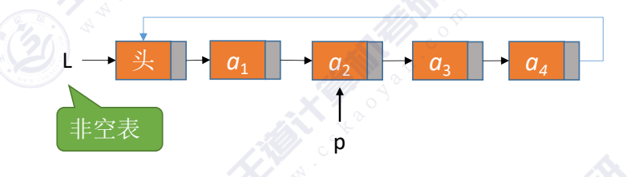
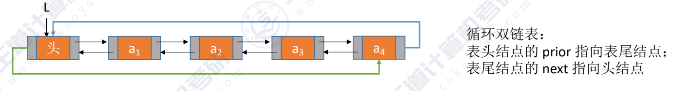
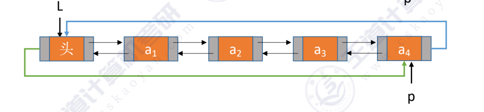
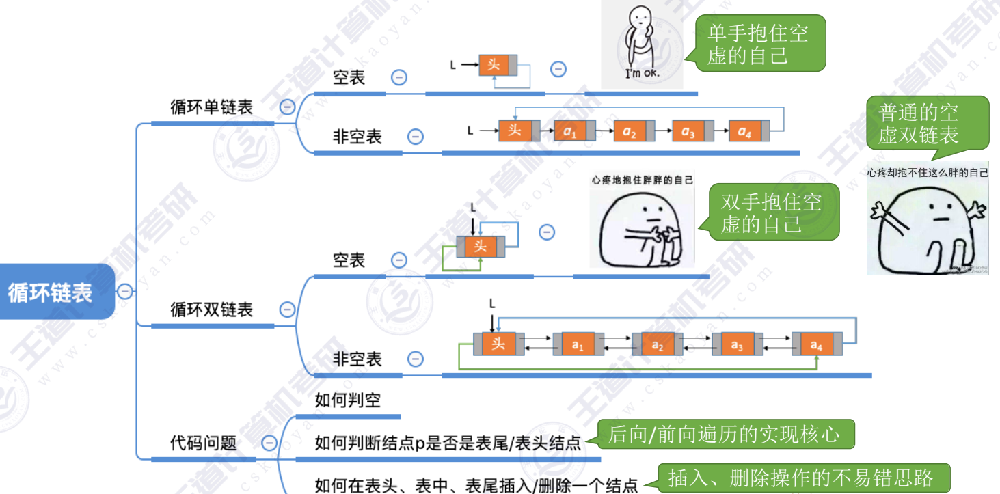

## 循环链表分为：
- 循环单链表
- 循环双链表

#### 循环单链表

~~~c
typedef struct LNode{
    ElementType data;
    struct LNode *next;
}LNode,*LinkList;

bool InitList(LinkList &L){ 
    L = (LNode *)malloc(sizeof(LNode));
    if(L==NULL) //内存不足，申请失败
        return false;
    L->next = L;  //头结点next指向自己
    return true;
}

bool Empty(LinkList L) //判断单链表是否为空
{   

     }

bool isTail(LinkList L,LNode *p) //判断p是不是尾结点
{
    if (p->next == L)
        return true;
    else
    return false;
}
~~~

从头结点找到尾部，时间复杂度为O(n)
从尾部找到头部，时间复杂度为O(1)

#### 循环双链表

~~~c
bool InitList(DLinkList &L) //初始化双链表
{
    L = (DNode  *)malloc(sizeof(DNode));
    if(L == NULL)
        return false;
    L->prior = NULL;  //头结点的prior指向空
    L->next = L; //头结点的next指向自己
    return true;
}

void testDLinkList()
{ 
    //初始化双链表
    DLinkList L;
    InitDLinkList(L);
    ...
}

bool InsertNextDNode(DNode *p, DNode *s)
{
    s->next = p->next;  //将结点s插入到p结点之后
    p->next->prior = s;
    s->prior = p;
    p->next = s;
}

//双链表的删除
/*
p ->next = q -> next;
q ->next->prior = p;
free(q);
*/
~~~

---
结：
