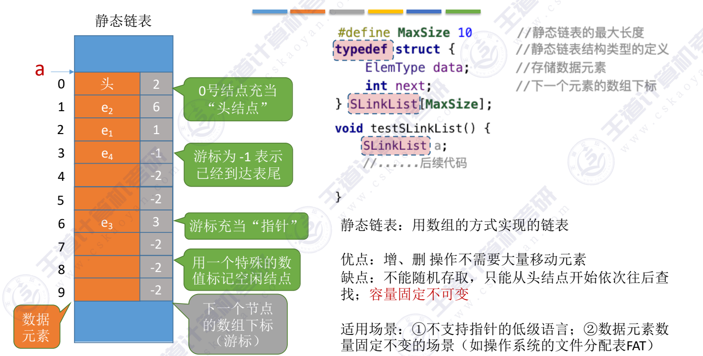

#### 定义
~~~c
#define MAXSIZE 10  //静态链表的最大长度
typedef struct{
    Elemtype data[MAXSIZE]; //存放数据
    int next; //存储下一个元素的下标
}SLinkList[MAXSIZE];
~~~

删除：插入位序为 i 的结点：
1. 找到一个空的结点，存入数据元素
2. 从头结点出发找到位序为 i-1 的结点
3. 修改新结点的 next
4. 修改 i-1 号结点的 next

删除某个结点：
1. 从头结点出发找到前驱结点
2. 修改前驱结点的游标
3. 被删除结点 next 设为 -2
---
结论
