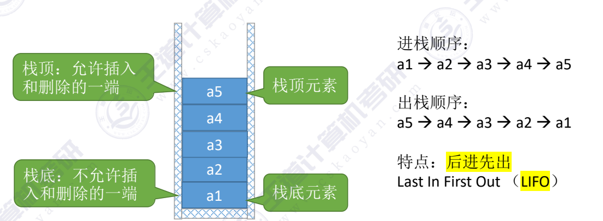
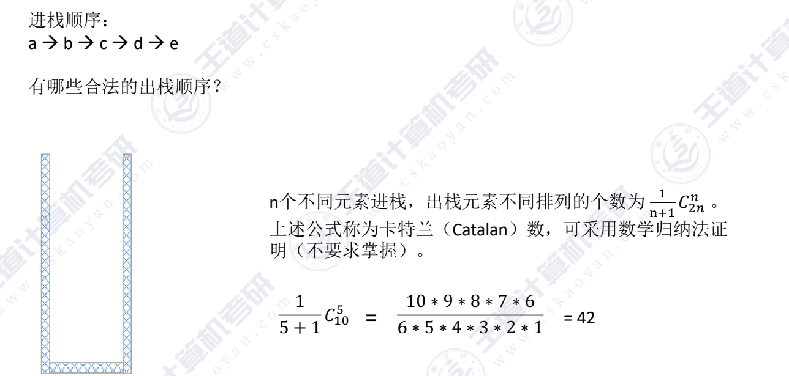
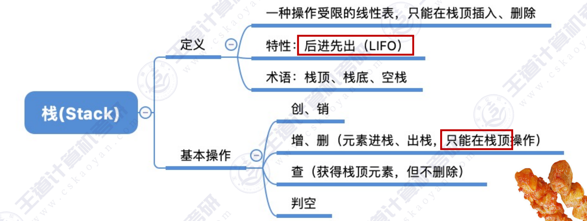

### 定义
栈（stack）：只允许在一端进行插入或删除操作的线性表

##### 相应操作：
- InitStack(&S)：初始化栈。构造一个空栈 S，分配内存空间。
- DestroyStack(&S)：销毁栈。销毁并释放栈 S 所占用的内存空间。

- Push(&S,x)：进栈，若栈S未满，则将x加入使之成为新栈顶。
- Pop(&S,&x)：出栈，若栈S非空，则弹出栈顶元素，并用x返回。

其他常用操作:
- StackEmpty(S)：判断一个栈 S 是否为空。若S为空，则返回true，否则返回false

##### 关于出栈问题：

---
结：
