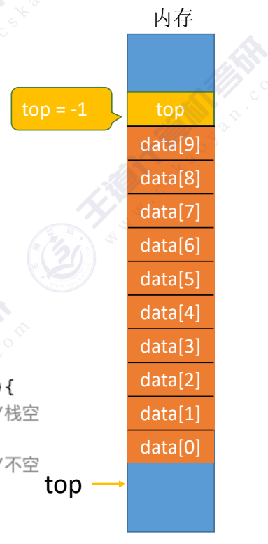
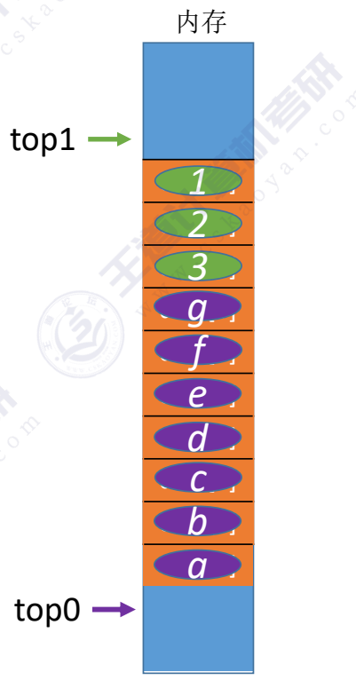
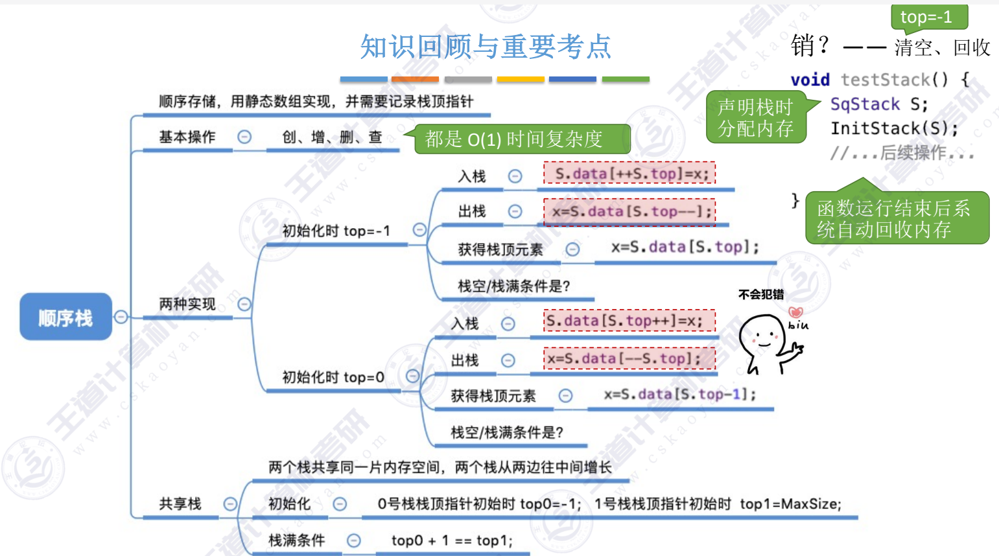

#### 顺序栈的定义
~~~c
#define MAXSIZE 10  //顺序栈的定义
typedef struct{
    ElemType data[MAXSIZE];
    int top;
}SqStack;

void InitStack(SqStack &S) //栈的初始化
{
    S.top = -1; //初始化栈顶指针
}

bool StackEmpty(SqStack S) //判断栈是否为空
{
    if(S.top == -1)
        return true;
    return false;
}

void testStack()  
{
    SqStack S;
    ...
}
~~~

#### 进栈
~~~c
bool Push(SqStack &S,Elemtype x)
{
    if(S.top == MAXSIZE-1) //栈满，报错
        return false;
    S.top = S.top + 1;  //指针先加1
    S.data[S.top] = x;  //新元素入栈  以上两句相当于：S.data[++S.top] = x;
    return true;
}
~~~

#### 出栈
~~~c
bool Pop(SqStack &S,Elemtype &x)
{
    if (S.top == -1)  //栈为空，无法出栈
        return false;
    x=S.data[top--];
    return true;
}

//类似的还有读栈：
bool GetTop(SqStack S,Elemtype &x)
{
    if (S.top == -1)
        return false;
    x =S.data[S.top];
    return true;
}
~~~

####若让top初始指向0:
~~~c
void InitStack(SqStack &S) //栈的初始化
{
    S.top = 0; //初始化栈顶指针
}

bool StackEmpty(SqStack S) //判断栈是否为空
{
    if(S.top == 0)
        return true;
    return false;
}

~~~
栈满的条件为：top == MAXSIZE

#### 共享栈
~~~c
#define MAXSIZE 10
typedef struct{
    ElemType data[MAXSIZE];
    int top0;  //栈0的栈顶指针
    int top1;  //栈1的栈顶指针
}SqStack;

void InitStack(SqStack &S) //栈的初始化
{
    S.top0 = -1;
    S.top1 = MAXSIZE;
}
~~~
栈满的条件top0 == top1

---
结：

