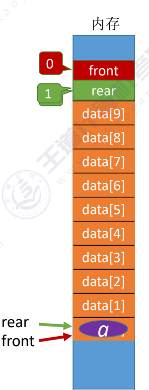
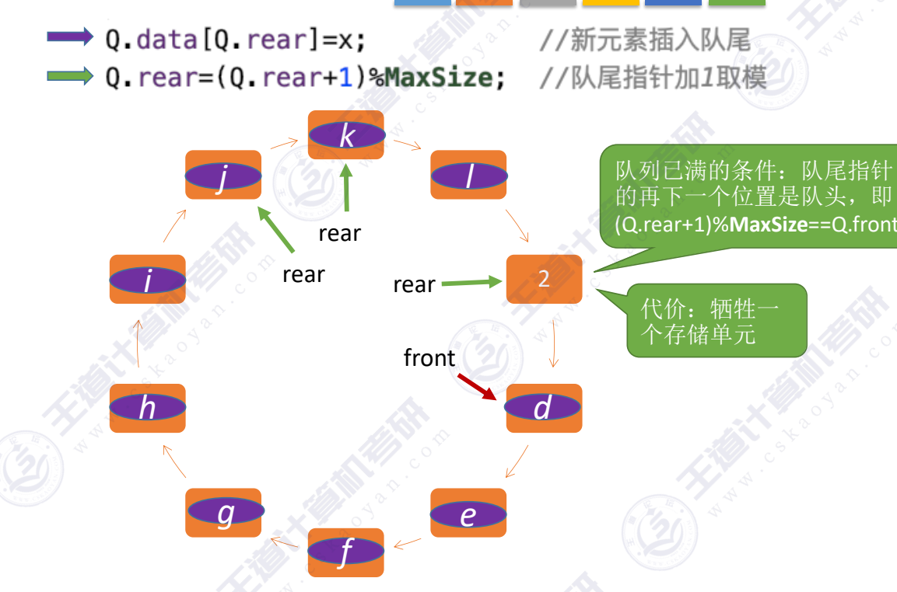
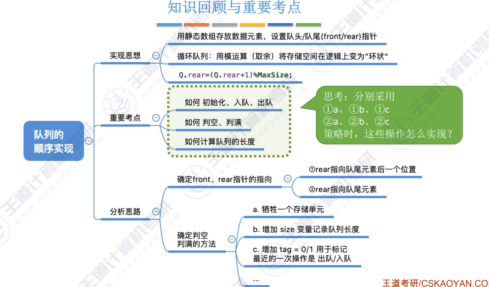

### 队列的顺序实现
~~~c
#define MAXSIZE 10
typedef struct{
    ElemType data[MAXSIZE];  //用静态数组存放队列元素
    int front,rear; //队头指针，队尾指针
}SqQueue;

void InitQueue(SqQueue &Q) //初始化队列
{
    Q.rear = Q.front = 0; //初始化队头指针和队尾指针
}

bool QueueEmpty(SqQueue Q) //判断队列是否为空
{
    if(Q.front == Q.rear)
        return true;
    return false;
}

void testQueue()
{
    SqQueue Q;
    InitQueue(Q);
    ...
}

~~~

### 入队
~~~c
bool EnQueue(SqQueue &Q,ElemType x)
{
    if(Q.rear == MAXSIZE)
        return false;
    Q.data[Q.rear] = x; //将x插入队尾
    Q.rear = Q.rear + 1; //队尾指针后移 
    /*
    也可以写Q.rear = (Q.rear + 1) % MAXSIZE; 队尾指针后移,使得队成为一个环状
    */
    return true;    
}
~~~

  

### 循环队列
循环队列：
同时：
- 队满的条件则为Q.rear + 1 %MaxSize = Q.front
- 队空的条件则为Q.rear = Q.front
- 队头元素为Q.data[Q.front]
- 队尾元素为Q.data[Q.rear - 1]
- 队列元素个数：(rear+MaxSize-front)%MaxSize

~~~c
bool QueueEmpty(SqQueue Q) //判断队列是否为空
{
    if(Q.front == Q.rear)
        return true;
    return false;
}

bool EnQueue(SqQueue &Q,ElemType x)
{
    if((Q.rear + 1) % MAXSIZE == Q.front)
        return false;
    Q.data[Q.rear] = x;     //将x插入队尾
    Q.rear = (Q.rear + 1) % MAXSIZE; //队尾指针后移
    return true;
}

bool DeQueue(SqQueue &Q,ElemType &x)
{
    if(Q.front == Q.rear)  //判定队空
        return false;
    x = Q.data[Q.front]; //队头元素出队
    Q.front = (Q.front + 1) % MAXSIZE; //队头指针后移
    return true;
}

bool GetHead(SqQueue Q,ElemType &x)//读队头元素
{
    if(Q.front == Q.rear) //队空
        return false;
    x = Q.data[Q.front];
    return true;
}
~~~
#### 判断循环队列已空、已满
1. 队尾指针的再下一个位置是队头，即(Q.rear+1)%MaxSize==Q.front

2. 初始化时使用一个size变量记录队列的元素数，队满时：size==MaxSize

3. 设置一个删除标志tag，每次删除操作成功时令tag=0，失败时tag=1，由于只有删除操作，才可能导致队空；只有插入操作、才可能导致队满
 ***故：队满条件：front==rear && tag == 1***

还有其他考法见pdf：

---
结：
