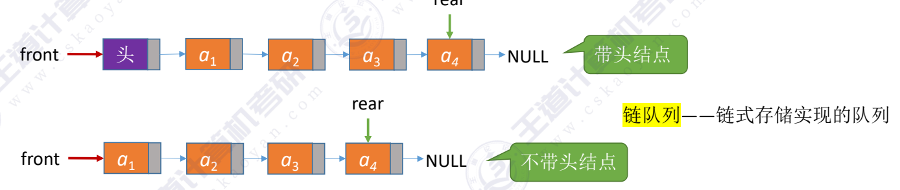
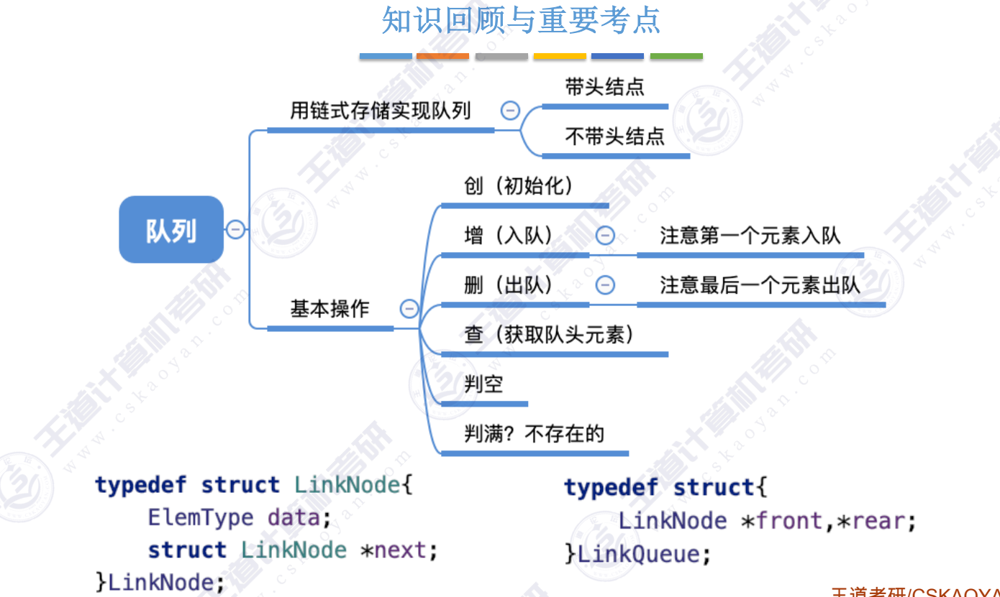

~~~c
typedef struct LinkNode{  //定义链栈结点
    ElemType data;
    struct LinKNode *next;
}LinkNode;

typedef struct{  //定义链栈
    LinkNode *front,rear;   //头指针，尾指针
}LinkQueue;
~~~

### 带头结点
~~~c
typedef struct LinkNode{  //定义链栈结点
    ElemType data;
    struct LinkNode *next;
}LinkNode;

void InitQueue(LinkQueue &Q) //初始化队列
{
    Q.front = Q.rear = (LinkNode *)malloc(sizeof(LinkNode));
    Q.front->next = NULL;
}

bool QueueEmpty(LinkQueue Q) //判断队列是否为空
{
    if(Q.front == Q.rear)
        return true;
    return false;
}

void EnQueue(LinkQueue &Q,ElemType x)
{
    LinkNode *s = (LinkNode *)malloc(sizeof(LinkNode));
    s->data = x;
    s->next = NULL;
    s->next = NULL;
    Q.rear->next = s; //新指针插入到rear之后
    Q.rear = s; //更新rear
}

bool DeQueue(LinkQueue &Q,ElemType &x)
{
    if(Q.front == Q.rear)  //队列为空
        return false;
    LinkNode *p =Q.front->next; //p指向队头元素
    x = p->data;  //用变量x返回队头元素
    Q.front->next = p->next; //修改头结点的next指针
    if(Q.rear == p)  //删除的是唯一的元素
        Q.rear = Q.front;     ////更新rear指针
    free(p);
    return true;
}

int main() 
{
    LinkQueue Q; //声明一个队列
    InitQueue(Q); //初始化队列
}
~~~

### 不带头结点
~~~c
void InitQueue(LinkQueue &Q) //初始化队列
{
    Q.front =NULL;
    Q.rear =NULL;
}

bool IsEmpty(LinkQueue Q) //判断队列是否为空
{
    if(Q.front ==NULL)
        return true;
    return false;
}

void EnQueue(LinkQueue &Q,ElemType x)
{
    LinkNode *s = (LinkNode *)malloc(sizeof(LinkNode));
    s->data = x;
    s->next = NULL;
    if(Q.front ==NULL) //队列为空
    {
        Q.front = s;  //将空队列插入到第一个元素
        Q.rear = s; //修改队头队尾指针
    }
    else
    {
        Q.rear->next = s; //将新元素插入到队尾
        Q.rear = s; //修改rear指针
    }
}

bool DeQueue(LinkQueue &Q,ElemType &x)
{
    if(Q.front ==NULL)  //队列为空
        return false;
    LinkNode *p =Q.front; //p指向此次出队的元素
    x = p->data; //用变量x返回队头元素
    Q.front = p->next; //修改front指针
    if(Q.rear == p)  //此次是最后一次结点的出队
    {
        Q.front =NULL;  //front指向NULL
        q.rear =NULL; //rear指向NULL
    }
    free(p);
    return true;
}
~~~
---
结：

