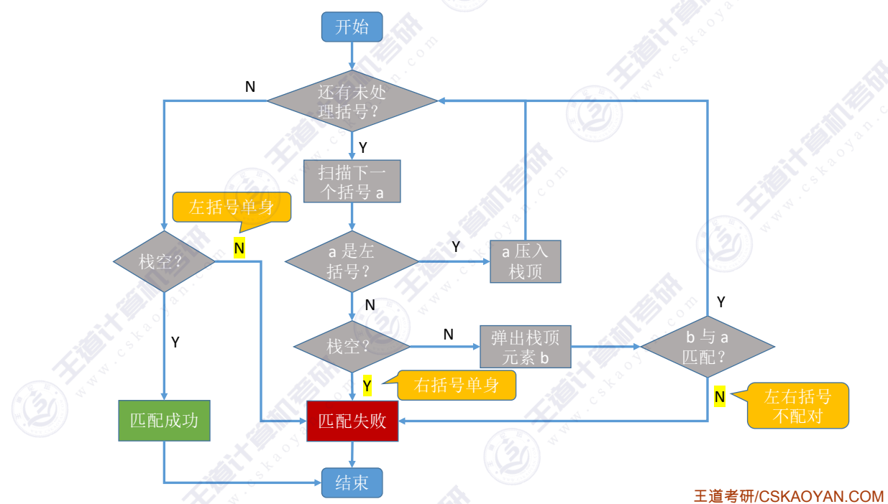
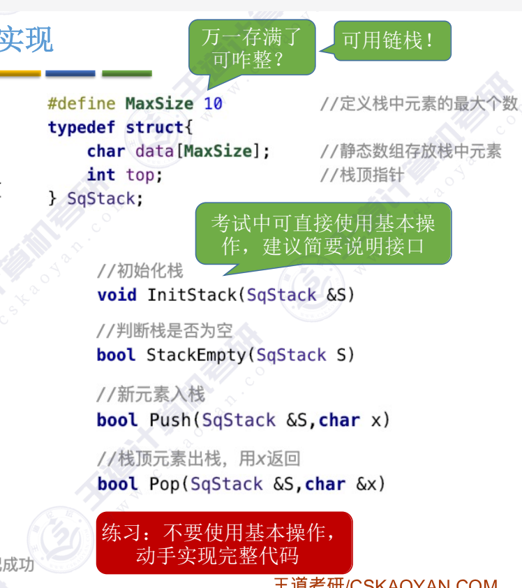

~~~c
bool bracketCheck(char str[], int length)
{
    SqStack S;
    InitStack(S);
    for (int i = 0; i < length; i++)
    {
        if(str[i] == '(' || str[i] == '[' || str[i] == '{')
            Push(S, str[i]);
        else(str[i] == ')' || str[i] == ']' || str[i] == '}')
          {
          if(StackEmpty(S)) //栈为空
                return false; //栈为空，括号不匹配
            char topElem;
            Pop(S, topElem);
            if(str[i] == ')' && topElem != '(')
                return false;
            if(str[i] == ']' && topElem != '[')
                return false;
            if(str[i] == '}' && topElem != '{')
                return false;
        }
    }
    return StackEmpty(S);
}

