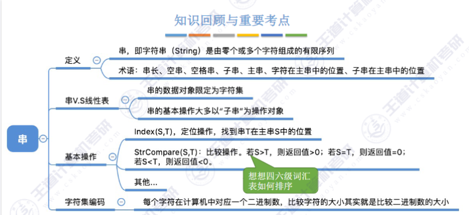

# 定义
即字符串（String）是由零个或多个字符组成的有限序列

例:
S=”HelloWorld!”
T=‘iPhone 11 Pro Max?’

***ps:串的索引是从1而不是从0开始的***

- 串的数据对象限定为字符集（如中文字符、英文字符、数字字符、标点字符等）
- 串的基本操作，如增删改查等通常以子串为操作对象
- 串是一种特殊的线性表
---

## 基本操作

- StrAssign(&T,chars)：赋值操作。把串T赋值为chars。
- StrCopy(&T,S)：复制操作。由串S复制得到串T。
- StrEmpty(S)：判空操作。若S为空串，则返回TRUE，否则返回FALSE。
- StrLength(S)：求串长。返回串S的元素个数。
- ClearString(&S)：清空操作。将S清为空串。
- DestroyString(&S)：销毁串。将串S销毁（回收存储空间）。
- Concat(&T,S1,S2)：串联接。用T返回由S1和S2联接而成的新串
- SubString(&Sub,S,pos,len)：求子串。用Sub返回串S的第pos个字符起长度为len的子串。
- **Index(S,T)**：定位操作。若主串S中存在与串T值相同的子串，则返回它在主串S中第一次出现的
位置；否则函数值为0。
- **StrCompare(S,T)**：比较操作。若S>T，则返回值>0；若S=T，则返回值=0；若S<T，则返回值<0。
假设有串T=“”，S=”iPhone 11 Pro Max?”，W=“Pro”

__假设有串T=“”，S=”iPhone 11 Pro Max?”，W=“Pro”__

Eg：执行基本操作Concat(&T, S, W)后，T=“iPhone 11 Pro Max?Pro”
执行基本操作SubString(&T ,S, 4, 6)后，T=“one 11” 

---

