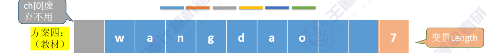
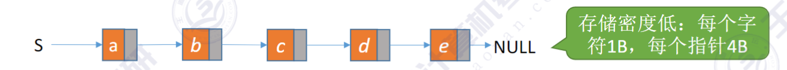
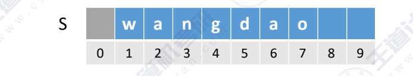

**串的存储结构**：
- 顺序存储
- 链式存储


## <font color=red>1.顺序存储</font>
**静态数组的实现（定长顺序存储）**
```c
# define MAXLEN 255 // 最大长度

typedef struct{
    char ch[MAXLEN]; // 串的存储结构
    int length; // 串的长度
}SString;
```

**动态数组的实现（堆分配存储）**
```c
#define MAXLEN 255

typedef struct{
    char *ch; // 串的存储结构
    int length; // 串的长度
}HString;

HString S;
S.ch = (char *)malloc(MAXLEN * sizeof(char)); // //按串长分配存储区，ch指向串的基地址 用完需要free
s.length = 0; //初始长度为0
```



## <font color=red>2.链式存储</font>

```c 
typedef struct StringNode{
    char ch[1]; // 每个结点存储1个字符
    struct StringNode *next; // 指向下一个结点
}StringNode, *String; 
```



---
## 基本操作的实现

```c
S.ch=“wangdao”
S.length=7
```

- SubString(&Sub,S,pos,len)：求子串。用Sub返回串S的第pos个字符起长度为len的子串。

```c
bool SubString(SSString &Sub, SString S, int pos,int len){
//子串范围越界
if (pos+len-1 > S. length)
    return false;
for (int i=pos; i<pos+len; i++)
    {
        Sub. ch[i-pos+1] = S. ch[i];
        Sub. length = len;
        return true;
    }
}
```


- StrCompare(S,T):比较操作。若S>T，则返回值>0；若S=T，则返回值=0；若S<T，则返回值<0。   
```c
int StrCompare(SSString S, SString T) {
for (int i=1; i<=S. length && i<=T.length; i++){
    if (S. ch[i] != T. ch[i])
        return S. ch[i]-T. ch[i];
    return S. length-T. length;
    //扫描过的所有字符都相同，则长度长的串更大
}
```

- Index(S,T):定位操作。若主串S中存在与串T值相同的子串，则返回它在主串S中第一次出现的位置；否则函数值为0
```c
Index(SString S, SString T){
int i = 1,n=StrLength(S),m=StrLength(T);    // 主串长度和子串长度
SString sub; // 子串
while (i<=n-m+1) // 串S的长度至少要大于串T的长度
{
    SubString(sub,S,i,m); // 获取子串
    if (StrCompare(sub,T)==0) ++i; // 子串与T相等
    else return i; // 返回字串匹配位置
}
return 0;//未找到与T相等的的匹配字串
```

