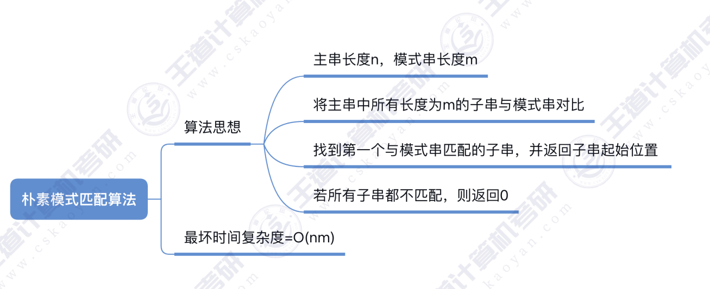

# Index(S,T)
定位操作。若主串S中存在与串T值相同的⼦串，则返回它在主串S中第⼀次出现的位置；否则函数值为0

~~~c
int Index(SqString S,SqString T)
{
    int i = 1,j = 1;
    while(i <= S.length && j <= T.length)
        if(S.ch[i] == T.ch[j])
         {
            ++i,++j;
         }
        else{
            i = i - j + 2;
            j = 1; //匹配失败，j回到1
        }
    if(j > T.length)
        return i - T.length;
    else
        return 0;
}

设主串⻓度为 n，模式串⻓度为 m，则:最坏时间复杂度 = O(nm)
~~~

# ps:还有next数组之类的看pdf和书，我懒得弄了