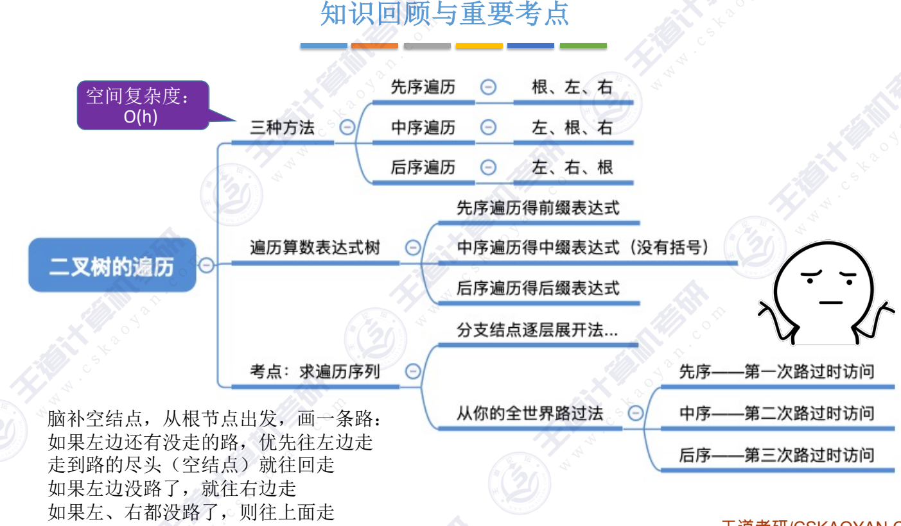

## 先序遍历
~~~c
void InOrder(BitTree T)
{
    if(T != NULL)
    {
        InOrder(T->lchild); //递归遍历左子树
        visit(T); //访问根结点
        InOrder(T->rchild); //递归遍历右子树
    }

}
~~~
## 后序遍历
~~~C
void PostOrder(BitTree T)
{
    if(T != NULL)
    {
        PostOrder(T->lchild);
        PostOrder(T->rchild);
        visit(T);
    }
}
~~~

## DLC:求树的深度（应用）
~~~c
int treeDepth(BitTree T)
{
    if(T == NULL)
        return 0;
    else
        int l = treeDepth(T->lchild);
        int r = treeDepth(T->rchild);
        //树的深度 = MAX(左子树深度, 右子树深度) + 1
        return (l > r ? l : r) + 1;
}
~~~
---
结：

