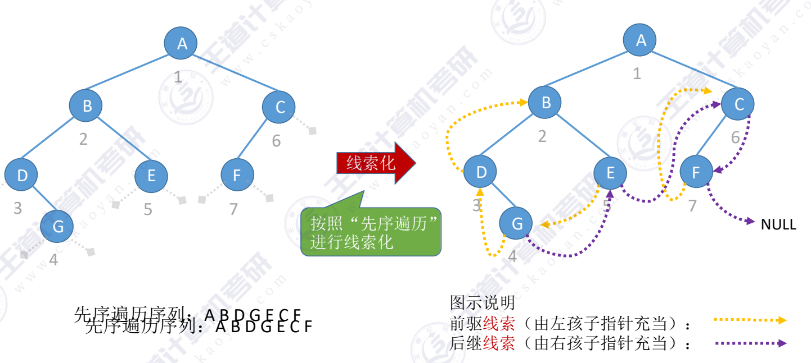
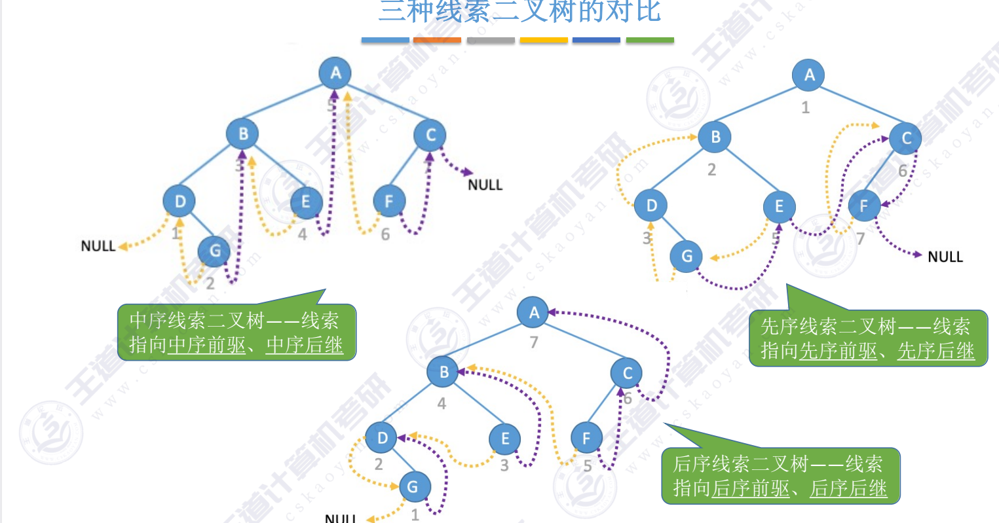
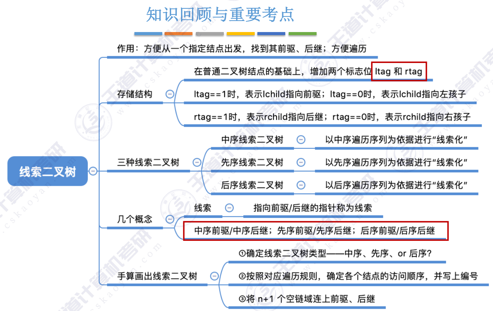

## 中序线索二叉树
1. 指向前驱、后继的指针称为“线索”
2. 前驱线索（由左孩子指针充当）：
3. 后继线索（由右孩子指针充当）：

设置一个ltag和rtag变量，用于表示左右线索的标志，tag == 0后继线索（由右孩子指针充当）；tag==1，表示指针是“线索”

~~~c
typedef struct BiTnode //链式存储二叉树的结点
{
    Elemtype data;
    struct BiTnode *lchild,*rchild;
}Bitnode,*Bitree;

typedef struct Threadnode //线索二叉树的结点
{
    Elemtype data;
    struct Threadnode *lchild,*rchild;
    int ltag,rtag; 
}Threadnode,*Threadtree;

~~~

## 三种线索二叉树的对比:

---
结：
