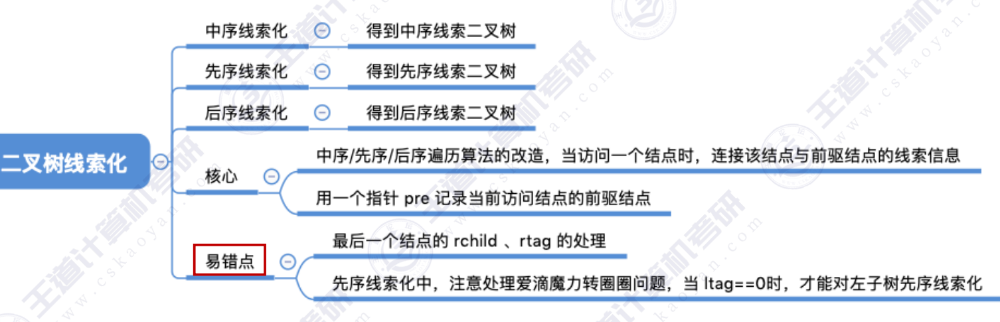

## 用土办法找二叉树的中序前驱
~~~c
void InOrder(BitTree T)
{
    if(T != NULL)
    {
        InOrder(T->lchild);
        visit(T);
        InOrder(T->rchild);
    }
}

void visit(BitTree *q) //访问节点q
{
    if(q == p)  //当前访问的结点刚好是p
    {
        final = q; //找到p的前驱
    }
    else 
    {   
        pre = q; //pre指向当前访问的结点
    }
    BiTNode *p ; //*p指向目标结点
    BiTNode * pre = NULL; //用于记录当前访问的前驱结点
    BiTNode * final = NULL; //用于记录最终结果
}
~~~

## 中序线索化
~~~c
typedef struct Threadnode{
    Elemtype data;
    struct Threadnode *lchild,*rchild;
    int ltag,rtag;  //ltag和rtag表示左右线索的标志
}Threadnode,*Threadtree;

void InThread(Threadtree &T,Threadtree &pre) //递归中序线索化
{
    if(T != NULL)
    {   
        InThread(T->lchild);  //中序遍历左子树
        visit(T);
        InThread(T->rchild); //中序遍历右子树
    }
}

void visit(Threadtree *q)  //访问结点
{
    if(q->lchild == NULL)
    {
        q->lchild = pre;
        q->ltag = 1;
    }
    if(pre != NULL && pre->rchild == NULL)
    {
        pre->lchild = q;
        pre->rtag = 1;
    }
    pre = q;
} 

//初始化pre为NULL
ThreadNode *pre = NULL;

void createInThread(Threadtree T)
{
    pre = NULL; //o初始化pre为NULL
    if(T != NULL) //非空二叉树才能被线索化
    {
        InThread(T); //中序线索化二叉树
        if(pre->rchild == NULL)
            pre->rtag = 1;
    }
}
~~~

## 先序线索化
~~~c
void preThread(Threadtree T)
{
    if(T != NULL)
    {   
        visit(T);
        PreThread(T->lchild);
        PreThread(T->rchild);
    }
}

void visit(ThreadNode *p)
{
    if(q->lchild == NULL) //左子树为空，建立前驱线索
    {
        q->lchild = pre;
        q->ltag = 1;
    }
    if(pre != NULL && pre->rchild == NULL) //右子树为空，建立后继线索
    {
        pre->rchild = q;
        pre->rtag = 1;
    }
    pre = q;
}

ThreadNode *pre = NULL;
~~~

## 后序线索化
~~~c
void PostThread(ThreadNode T)
{
    if(T != NULL) 
    {
        PostThread(T->lchild);
        postThread(T->rchild);
        visit(T);
    }
}

void visit(ThreadNode *q)
{
    if(q->lchild == NULL) //左子树为空，建立前驱线索
    {
        q->lchild = pre;
        q->ltag = 1;
    }
    if(pre != NULL && pre->rchild == NULL) //右子树为空，建立后继线索
    {
        pre->rchild = q;
        pre->rtag = 1;
    }
    pre = q;
}
~~~
---
结：

