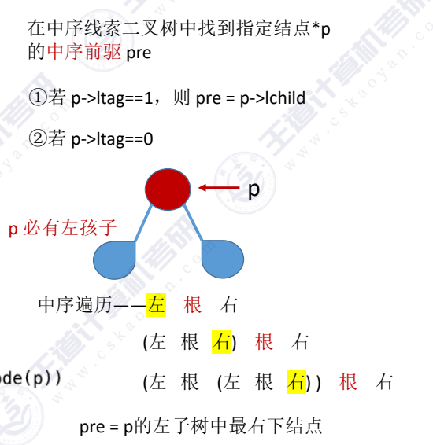
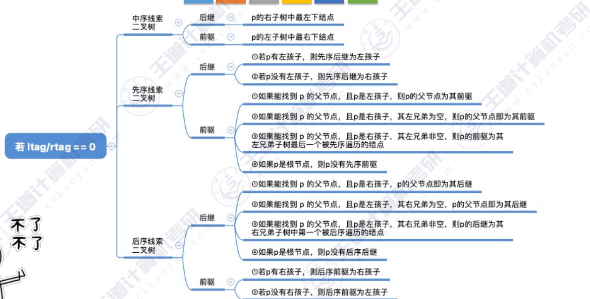

ps:这里只有中序线索二叉树找中序前驱，剩下的自己想看看pdf
~~~c
Threadnode *LastNode(Threadtree *p)
{
    while(p->rtag == 0)
        p = p->rchild;  //循环找到右下角的结点
    return p;
}

Threadnode *PreThread(Threadtree *p) //在中序线索二叉树中找到结点p的前驱结点
{
    if(p->ltag == 1)
    {
        return Lastnode(p->lchild);  //找到左子树的最右下结点
    }
    else return p->lchild;
}

void ReviseThread(Threadtree *T) //对中序线索二叉树进行逆向中序遍历
{
    for(Threadtree *p = T; p != N   ULL; p = p->rchild)
    {
        visit(p);
    }
}

~~~

---
结：
