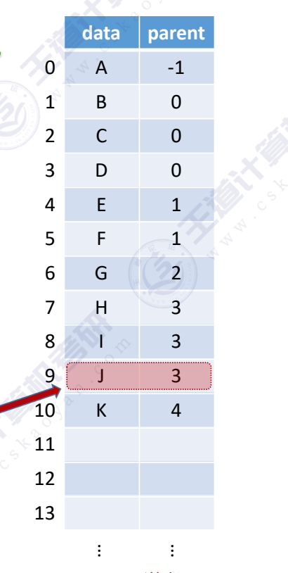
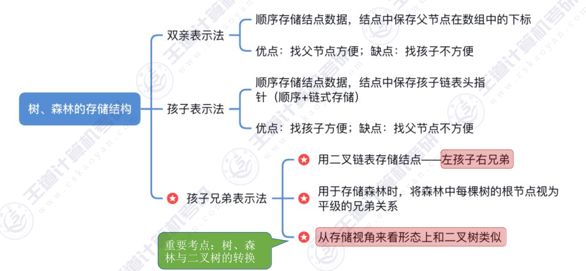

## 方法一：
双亲表示法：
~~~c
#define MAXSIZE 100
typedef struct{
    ElemType data; 
    int parent;
}PTNode; //树的结点定义

typedef struct{
    PTNode nodes[MAXSIZE]; 
    int n; //结点数
}PTree;  //树的类型定义
~~~

双亲表示法
优点：找双亲（父节点）很方便
缺点：找孩子不方便，只能从头到尾遍历整个数组
适用于“找父亲” 多，“找孩子” 少 的应用场景。如：并查集
## 方法二：
孩子表示法：用数组顺序存储各个结点。每个结点中保存数据元素、孩子链表头指针
~~~c
struct CTNode{
    int child;  //孩子结点
    struct CTNode *next;
};

typedef struct{
    Elemtype data;
    struct CTNode *firstchild;
}CTBox;

typedef struct{
    CTBox *nodes[MAXSIZE]; 
    int n,r; //结点数和根的位置
}CTree;

## 方法三：
孩子兄弟表示法：与二叉树类似，采用二叉链表实现。
每个结点内保存数据元素和两个指针，但两个指针的含义与二叉树结点不同

~~~c
typedef struct CSNode{
    Elemtype data;
    struct CSNode *firstchild; //指向第一个孩子结点
    struct CSNode *nextsibling; //指向右边第一个兄弟结点
}CSNode,*CSTree;

~~~
---
结：
