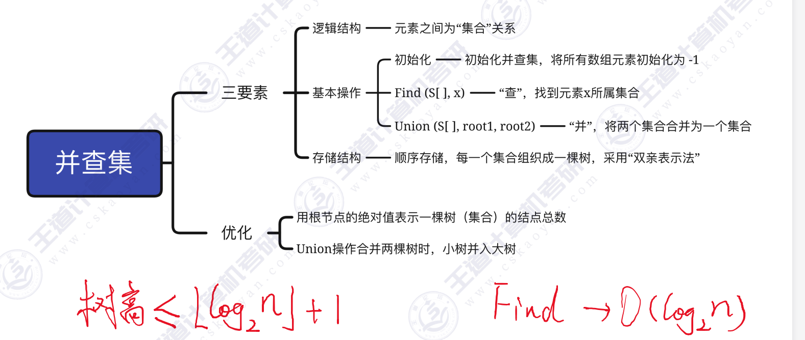

集合的两个基本操作——“并”和“查
- Find ——“查”操作：确定一个指定元素所属集合
- Union ——“并”操作：将两个不相交的集合合并为一
注：并查集（Disjoint Set）是逻辑结
构——集合的一种具体实现，只进行“并”和“查”两种基本操作

## 并查集的初始化

~~~c
#define Size 13
int UFSets[Size];

void initial(int S[])  //初始化
{
    for(int i = 0 ; i < size ; i++)
    {
        S[i] = -1;
    }
}

~~~
## 并&查
~~~c
//Find"查"操作，找x所属集合(返回x所属根结点)
int Find(int S[],int x)
{
    while(S[x]>=0) //循环寻找x的根
        x=S[x];
    return x; //根的s[]小于o
}//最坏时间复杂度 ：O(n)

//Union"并"操作，将两个集合合并为一个
void Union(int S[],int Rootl,int Root2)
{
    //要求Root1与Root2是不同的集合
    if(Root1==Root2)
        return;
    //将根Root2连接到另一根Root1下面
    S[Root2]=Root1;
}//时间复杂度 ：O(1)
~~~
## union的优化：
1. 用根节点的绝对值表示树的结点总数
2. union操作，让小树合并到大树

~~~c
//Union"并"操作，小树合并到大树
void Union(int S[],int Rootl,int Root2)
{
    if(Root1==Root2)
        return;
    if(S[Root2]>S[Root1])
    {//Root2结点数更少0
    S[Root1]+= S[Root2];//累加结点总数
    S[Root2]=Root1;//小树合并到大树
    }
     else {
        S[Root2]+= S[Root1];//累加结点总数
        S[Root1]=Root2;//小树合并到大树
    }
}
~~~~
该方法构造的树高不超过 $log_2n + 1$
---
结论：

