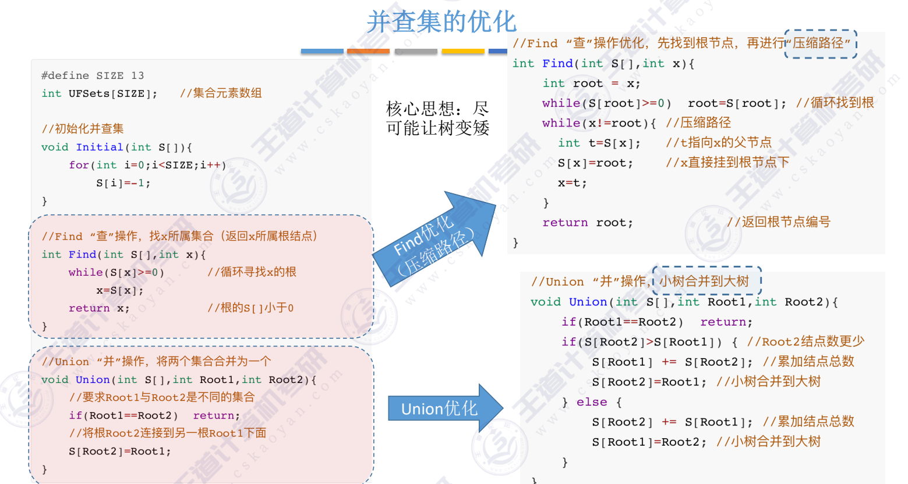
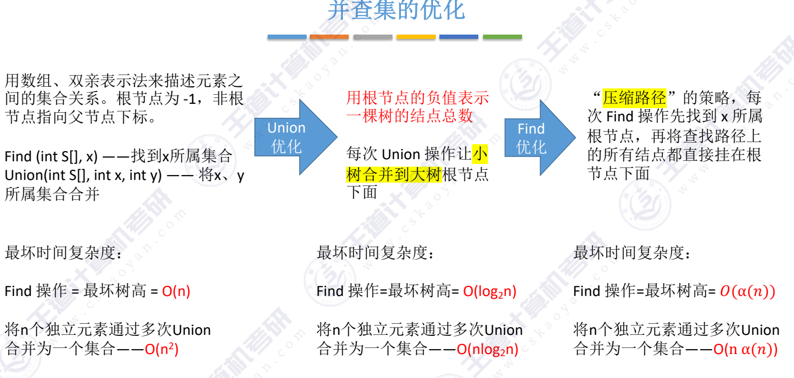

## Find 的优化
Find"查"操作优化，先找到根节点，再进行"压缩路径”
~~~c

int Find(int S[],int x)
{
    int root = x;
   
    while(S[root]>=0)
        root=S[root];//循环找到根
    while(x!=root)  //压缩路径
    {
        int t=S[x]; //t指向x的父节点
        S[x]=root;  //x直接挂到根节点下
        x=t;
    }
        return root;   //返回根节点编号
}
~~~
这块儿看看pdf吧，比较清晰：

